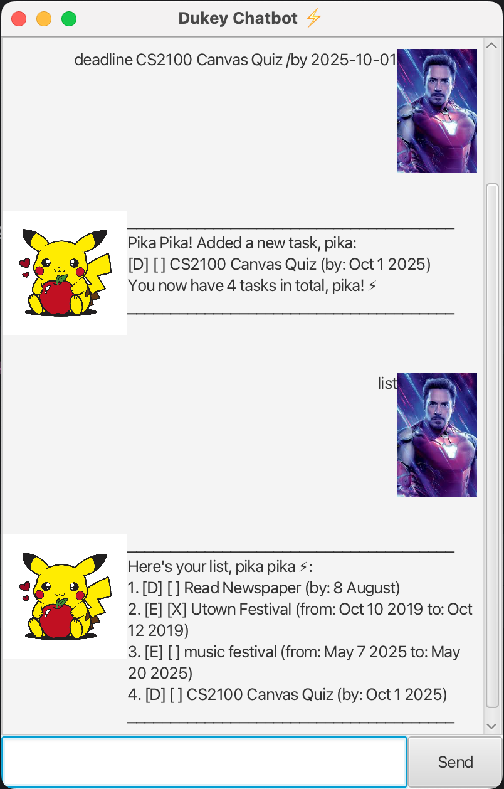

# Dukey User Guide

[//]: # (![UI of Dukey Chatbot]&#40;./Ui.png&#41;)


Dukey Chatbot is a simple yet powerful task manager that helps you stay on top of your daily commitments. 
With its playful personality and easy-to-use commands, you can organize tasks in seconds.

## 📝 Adding Tasks
Dukey allows you to add 3 types of tasks: `Todo`, `Deadline` and `Event` tasks.
### Todo
The command takes in a task description and adds it into the task list.

Input format: `todo <task description>`

Example: `todo Buy Groceries` or `t Buy Groceries`

Command can use `todo` or `t` (for ease of use) and will succesfully
add a todo task to the task list.

```
______________________________________
Pika Pika! Added a new task, pika:
[T] [ ] Buy Groceries
You now have 5 tasks in total, pika! ⚡
______________________________________
```

### Deadline
The command takes a task description and a date (or time), and adds it into the task list.
Throws an error if a date or time is not provided using the `/by` keyword.

Date or time input can be in the YYYY-MM-DD format or just a regular string.

Input format: `deadline <task description> /by <date or time>`

Example: `deadline Buy Groceries /by 2025-10-01` or `d Buy Groceries /by 2025-10-01`

Command can use `deadline` or `d` (for ease of use) and will succesfully
add a deadline task to the task list.

```
______________________________________
Pika Pika! Added a new task, pika:
[D] [ ] Buy Groceries (by: Oct 1 2025)
You now have 6 tasks in total, pika! ⚡
______________________________________
```

Example: `deadline CS2100 Quiz /by 10 August`

```
______________________________________
Pika Pika! Added a new task, pika:
[D] [ ] CS2100 Quiz (by: 10 August)
You now have 6 tasks in total, pika! ⚡
______________________________________
```
Example: `deadline CS2103 ip`

Without the `/by` flag, this input is invalid and will raise an error.
```
______________________________________
Pika… WARNING: Deadline command requires a deadline.
Valid input requires '/by' keyword. Follow the format: deadline <task name> /by <date / timing>
Dates can be written in yyyy-mm-dd format or just plain text
E.g. deadline Wash Clothes /by 2025-08-12
______________________________________

```

### Event
The command takes a task description, along with a _from_ and _to_ date (or time), and adds it into the task list.
Throws an error if a date or time is not provided using the `/from` and `/to` keyword.

Date or time input can be in the YYYY-MM-DD format or just a regular string.

Input format: `event <task description> /from <date or time> /to <date or time>`

Example: `event Utown Festival /from 2025-10-01 /to 2025-10-10` or 
`e Utown Festival /from 2025-10-01 /to 2025-10-10`

Command can use `event` or `e` (for ease of use) and will succesfully
add a event task to the task list.

```
______________________________________
Pika Pika! Added a new task, pika:
[E] [ ] Utown Festival (from: Oct 1 2025 to: Oct 10 2025)
You now have 5 tasks in total, pika! ⚡
______________________________________
```
Example: `event Farmer Market /from 25 Sep /to 29 Sep`

```
______________________________________
Pika Pika! Added a new task, pika:
[E] [ ] Farmer Market (from: 25 Sep to: 29 Sep)
You now have 6 tasks in total, pika! ⚡
______________________________________
```
Example: `event Maroon 5 Concert`

Without the `/from` and `/to` flag, this input is invalid and will raise an error.

```
______________________________________
Pika… WARNING: Event command requires a timeframe.
Valid input requires '/from' AND '/to' keyword. Follow the format: event <task name> /from <date / timing> /to <date / timing> 
Dates can be written in yyyy-mm-dd format or just plain text
E.g. event project meeting /from Mon 2pm /to 4pm
E.g. music festival /from 2025-05-07 /to 2025-05-20
______________________________________
```

## 📋 List
The command displays the current list of tasks.

Input format: `list`

Example: `list` or `li` (for ease of use)

```
______________________________________
Here's your list, pika pika ⚡:
1. [D] [ ] Read Newspaper (by: 8 August)
2. [E] [X] Utown Festival (from: Oct 10 2019 to: Oct 12 2019)
3. [E] [ ] music festival (from: May 7 2025 to: May 20 2025)
4. [D] [ ] CS2100 Canvas Quiz (by: Oct 1 2025)
5. [E] [ ] Utown Festival (from: Oct 1 2025 to: Oct 10 2025)
______________________________________
```


## ✅ Mark and Unmark
### Mark
The command changes the completion status of a task to __done__.

Input format: `mark <task number>`

Example: `mark 1` or `m 1` (for ease of use)

When task has been successfully marked as done, there is a confirmation message.
The [ ] box becomes [X] to mark the task as done.

```
______________________________________
Pika Pika! Task completed, pika! ✅
[D] [X] Read Newspaper (by: 8 August)
______________________________________
```

Example: For a list with 3 tasks, `mark 5`

As the task number exceeds the number of tasks in the list, an error is raised.

```
______________________________________
Pika pika! That task number is too big, pika!
Try again with a smaller number, pika!
______________________________________
```

### Unmark

The command changes the completion status of a task to __not done__.

Input format: `unmark <task number>`

Example: `unmark 1` or `unm 1` (for ease of use)

When task has been successfully unmarked, there is a confirmation message.
The [X] box becomes [ ] to mark the task as not done.

```
______________________________________
Pika… I’ve unmarked this task, pika:
[D] [ ] Read Newspaper (by: 8 August)
______________________________________
```
Example: For a list with 3 tasks, `unmark 5`

As the task number exceeds the number of tasks in the list, an error is raised.

```
______________________________________
Pika pika! That task number is too big, pika!
Try again with a smaller number, pika!
______________________________________
```


## ❌ Delete
The command __removes tasks__ from the list of tasks.

Input format: `delete <task number>`

Example: `delete 1` or `del 1` (for ease of use)

When task has been successfully deleted, there is a confirmation message.

```
______________________________________
Pika! I removed this task, pika:
[D] [ ] Read Newspaper (by: 8 August)
Now you have 5 tasks left, pika!
______________________________________
```
Example: For a list with 3 tasks, `delete 5`

As the task number exceeds the number of tasks in the list, an error is raised.

```
______________________________________
Pika pika! That task number is too big, pika!
Try again with a smaller number, pika!
______________________________________
```

## 🔍 Find
The command __searches through your task list__ and returns all tasks that contain the specified keyword.

Input format: `find <search keyword>`

Example: `find festival` or `f festival` (for ease of use)

If the list contains the keywords, then it is displayed as a list.

```
______________________________________
Here's your list, pika pika ⚡:
1. [E] [X] Utown Festival (from: Oct 10 2019 to: Oct 12 2019)
2. [E] [ ] music festival (from: May 7 2025 to: May 20 2025)
3. [E] [ ] Utown Festival (from: Oct 1 2025 to: Oct 10 2025)
______________________________________
```
If list does not contain the keyword, user is notified.
```
______________________________________
Pika… I couldn't find any tasks matching that keyword.
Try another keyword, pika!
______________________________________
```

## 👋 Bye
The command __terminates the chatbot__ and saves the list of tasks into the hard drive.

Input format: `bye`

Example: `bye` or `b` (for ease of use)

If the list contains the keywords, then it is displayed as a list.

```
______________________________________
Pika… bye-bye! 🐾
Hope to see you again soon, pika!
This chat will close in 5 seconds, pika!
______________________________________
```
